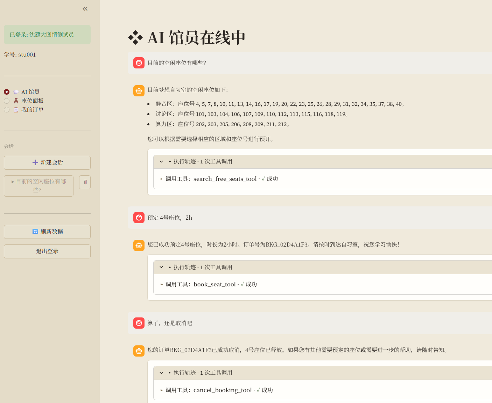
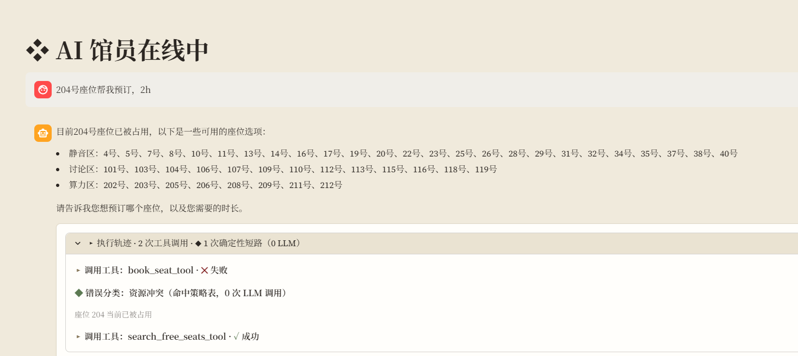
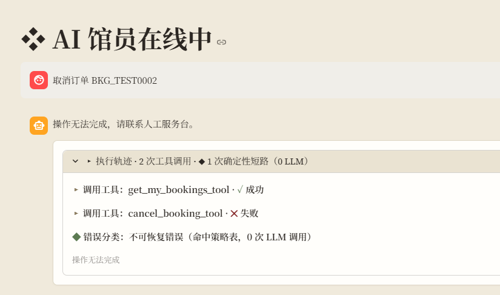
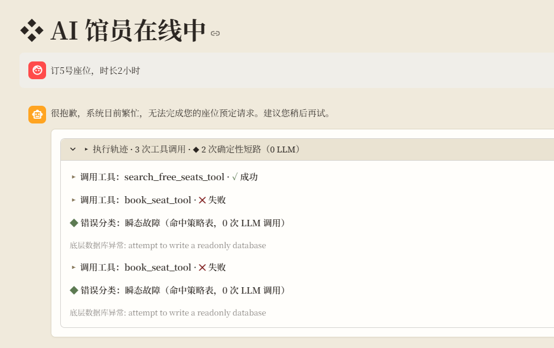
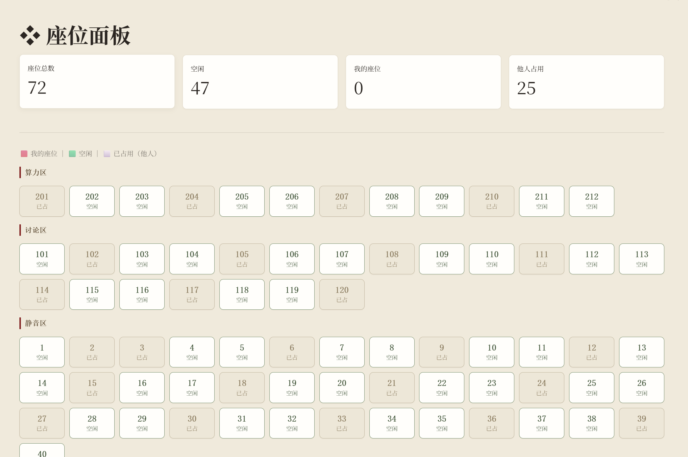
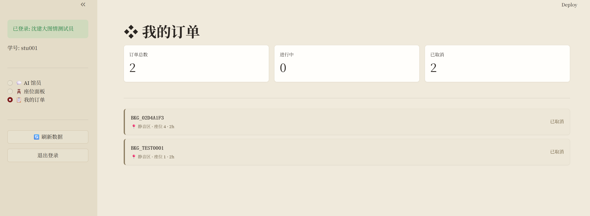
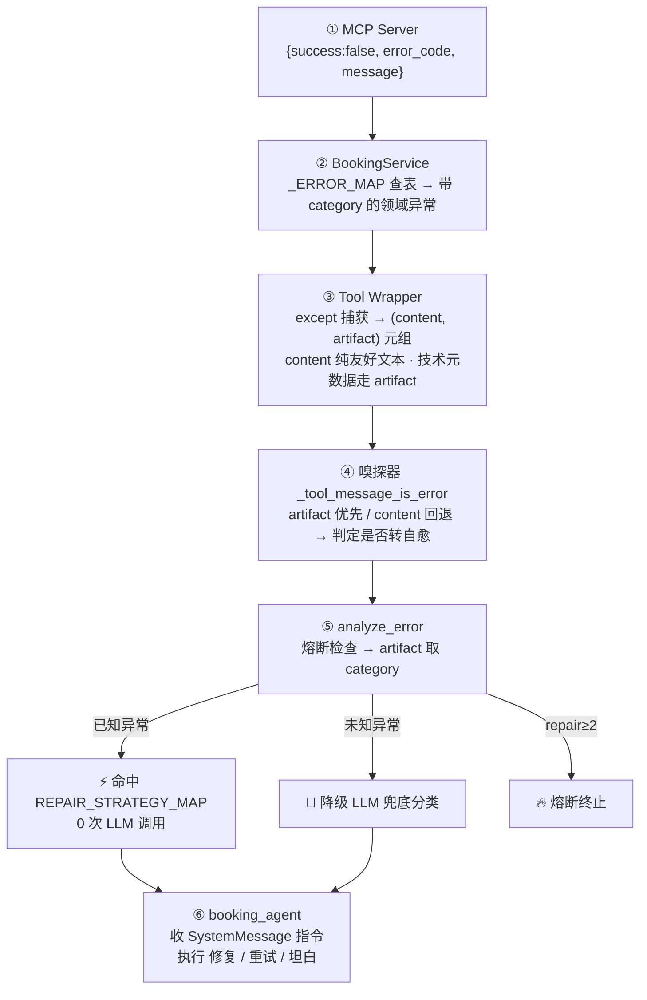

# 梦想自习室 · LangGraph Self-Healing Agent

[](https://github.com/Jmiao11/langgraph-self-healing-agent/actions/workflows/ci.yml)   

> 一个把「异常自愈」做成**代码层确定性路由**的 LangGraph 多智能体自习室预约系统——工具失败时，已知异常 **0 LLM 调用**查表修复、未知异常才降级 LLM 兜底；并以**多层物理隔离**挡住 Prompt 注入与越权访问。

> **一眼结果**：6 大核心异常 **100%** 自动恢复 · 已知异常 **0** LLM 调用（纯代码查表）· 跨子图上下文 **0** 污染（prompt_tokens **−66%**）· **3** 类越权攻击拦截 · **99** 测试全绿（L1 纯函数 + L2 mock）· 并在代码审查中**自查出并修复 3 处分类 / 判据缺陷' '自查出并修复 4 处分类 / 判据缺陷**。

------

## 项目演示

> 截图基于档案馆衬线主题；执行轨迹面板图标已统一为线条符号（▸ 工具 / ◆ 0-LLM 短路 / ◇ LLM 降级 / ⊘ 熔断），成败与熔断按主题色（墨绿 / 复古红）标注。

| 功能                                                         | 界面                                                     |
| ------------------------------------------------------------ | -------------------------------------------------------- |
| **异常自愈 · 执行轨迹可见**<br>「取消座位」连调 `get_my_bookings` + `cancel_booking`，自愈过程在面板逐行可见 |  |
| **0-LLM 短路**<br>订一个被占座位 → 命中 `resource_conflict`，0 次 LLM 调用直接查表修复 |            |
| **越权防护 · 静默拒绝**<br>试图操作他人订单 → 选 `UNRECOVERABLE` 静默拒绝，不泄露资源是否存在 |               |
| **熔断保护**（提前把 DB 设只读）<br>连续修复失败 → `repair_attempts ≥ 2` 强制终止，转坦白并建议稍后重试 |               |
| **实时座位面板（72 座）**<br>三区（静音 / 讨论 / 算力）网格，我的 / 空闲 / 已占三态一目了然 |                   |
| **三视图 + 多会话 CRUD**<br>AI 馆员 / 座位 / 我的预约三视图，侧栏会话可切换、可删除 |           |

------

## 核心设计：Self-Healing 自愈链路（整个项目的承重墙）

Agent 调工具失败时，绝大多数实现要么把异常裸抛给用户，要么把一段错误文本丢回 LLM 让它「自己看着办」——前者体验差，后者既慢又不可控。本项目的承重墙是一条**六跳错误处理链**：让代码而非 LLM 来决策「怎么修」，已知异常全程 0 次 LLM 调用。



**为什么是「LLM 答 What、代码答 How」**：`category`（5 类元数据）由 LLM 或查表确定「这是哪种错」，而「这种错怎么修」固化在静态的 `REPAIR_STRATEGY_MAP` 里——决策权归代码、归确定性查表，LLM 不参与修复策略选择。已知异常因此 0 LLM 调用、可被单元测试钉死。

### V1 → V4 演进

| 版本 | 核心改动                          | 解决 / 翻过的车                                     |
| ---- | --------------------------------- | --------------------------------------------------- |
| V1   | LLM 全权决策（RepairDecision）    | 基线——LLM 自相矛盾 + 幻觉工具名（翻车点）           |
| V2   | Classify-then-Decide + 策略表查表 | 剥离 LLM 决策权，代码层确定性路由                   |
| V3   | Prompt 边界锚定（四层防御）       | 修 LLM 语义边界混淆（SEAT_OCCUPIED 被误分类）       |
| V4   | 异常元数据短路路由                | 已知异常 0 LLM 调用，移除「LLM 必须分类」的错误前提 |

一个核心安全设计点：`NotYourBookingError`（删他人订单）**故意**选 `UNRECOVERABLE` 而非 `business_rule_violation`——静默拒绝、不给自愈链路任何「重试 / 解释」的机会，杜绝攻击者借错误信息探测资源是否存在。

### 诚实叙事：审查中自查并修复的 4 处缺陷

这条链路是逐步审查打磨出来的，过程中自己挖出并修掉了四个隐蔽缺陷，每处都配 L1 纯函数测试钉死（测试数随之 86 → 99）：

- **错误判据不一致**：嗅探器（是否转自愈）与定位逻辑（修哪条）各用一套「是否出错」判据；当 content 被清理成纯友好文本后两者会撕裂、自愈对着「没有错误」空转 → 收敛为**单一真相源**纯函数 `_tool_message_is_error`（artifact 优先 / content 回退，四处共用）。
- **`DB_ERROR` 误分类**：MCP 的数据库故障码 `DB_ERROR` 未登记进 `_ERROR_MAP`，兜底成 `unrecoverable`（直接放弃），可它本质是 `transient_failure`（该重试）→ 补映射修正。
- **查询工具漏异常映射**：`search` / `get_user_info` 失败被当「正常座位列表文本」喂给 LLM、自愈接不住 → 工具层补 `build_error_artifact` 纯函数 + 服务层接入 `_raise_from_result` 结构化映射，自愈链路对**全部**工具一致。

> 完整演进与机制见 [`docs/DESIGN.md` §3.2](./docs/DESIGN.md)

------

## 系统架构


**四层架构**：

| 层         | 职责                             | 关键文件                         |
| ---------- | -------------------------------- | -------------------------------- |
| 用户接入层 | HTTP 认证 + Streamlit UI         | `api.py`, `app.py`               |
| 编排层     | 多子图路由 + 状态总线            | `graphs/`                        |
| 业务服务层 | 异常映射 + RRF 检索融合          | `services/`                      |
| 基础设施层 | LLM 池 + ChromaDB + SQLite + MCP | `infrastructure/`, `mcp_server/` |

------

## 其他设计亮点

### 多层身份隔离：把越权堵在物理层

```
请求 → HMAC Token 验签 → trusted_sid 强制覆盖 body
       ↓
  make_tools_for_user(authenticated_sid)
  # student_id 从工具签名物理删除，LLM 根本拿不到、无法传递
       ↓
  cancel_booking(booking_id)  ← LLM 只看到这个
  # 底层实际: cancel_booking(authenticated_sid, booking_id)
       ↓
  DB 层: 存在 → 归属 → 状态  三段式校验
```

身份不是「提示 LLM 别越权」，而是从工具签名里**物理删除** `student_id`——LLM 没有这个参数可填，注入也无从注入。实测拦截 3 类核心越权场景。

### 多会话管理：双层持久化 + 归属闸门 + CRUD 闭环

checkpointer 与会话注册表职责分离：前者存引擎状态（按 `thread_id`），后者存业务元数据（按 `user_id`），`thread_id` 为 join key。增 / 查 / 删 CRUD 完整：`/api/history` 与 `DELETE /api/sessions/{tid}` 都先过 `verify_owner` 归属闸门，非归属 / 不存在一律 **404 静默拒绝**（与取消订单的 IDOR 防护同源）。删除采用「registry 权威删除 → checkpointer best-effort 清理」：先删真相源保证「列表消失」与「历史不可读」永远同步，再 try/except 清孤儿图状态、失败不拖垮主操作。

> 完整设计见 [`docs/DESIGN.md` §4](./docs/DESIGN.md)

### 执行轨迹可观测性：让自愈从黑箱变可证

Agent 的工具调用与自愈全在后端，UI 看不见。关键认知是 `AgentState.trace` 早已由子图节点写入、`merge_trace` 哨兵 reducer 每轮清零——`aget_state` 一次读回即本轮完整链路，无需重构。纯函数 `summarize_execution_trace` 把它翻译成 ▸ 工具成败 / ◆ 0-LLM 短路 / ◇ LLM 降级 / ⊘ 熔断 四类步骤（L1 +14）；`/api/chat` 读取塞入 `ChatResponse.activity`，全程 try/except——可观测性绝不拖累主响应。让「自愈」从口头卖点变成肉眼可证。

> 完整设计见 [`docs/DESIGN.md` §5](./docs/DESIGN.md)

### 双路 RRF 融合检索

知识库问答走 BM25 字面量召回 + 向量语义召回，RRF 算法（k=60，只用名次不用原始分）融合排序，绕开两路分数量纲不可比的标定难题；支持 LLM 自动元数据打标过滤。

------

## 快速开始

```bash
# 1. 配置环境变量
cp .env.example .env
# 填入 MOONSHOT_API_KEY / SILICONFLOW_API_KEY / AUTH_SECRET_KEY / AMAP_MAPS_API_KEY

# 2. 安装依赖
pip install -r requirements.txt

# 3. 初始化数据库与向量库
python mcp_server/init_db.py
python graphs/init_vector_db.py

# 4. 启动后端 API
python api.py

# 5. 启动前端（新开终端）
streamlit run app.py
```

**测试账号**：学号 `stu001` / 密码 `123`

**复现测试**（全部离线，无需 key / 网络 / MCP）：

```bash
pytest -q          # 99 passed —— L1 纯函数 + L2 mock
```

------

## 目录结构

```
api.py            FastAPI：认证 + /api/chat + /api/sessions(增删查) + /api/history
app.py            Streamlit：登录 + 三视图导航 + 会话侧栏(切换 / 删除)
graphs/           router(rule_filter → llm_router 两道防线) + 4 子图
                  booking_self_healing_subgraph：自愈核心 + _tool_message_is_error 单一判据
                                                 + build_error_artifact 异常映射纯函数
services/         booking_service(_ERROR_MAP + _raise_from_result) · retrieval_service
                  session_registry(会话 CRUD，归属内建 WHERE，静默拒绝)
schemas/          exceptions(ErrorCategory 5 类 + 领域异常体系)
                  state(AgentState + merge_trace 哨兵 reducer，trace 每轮清零)
utils/            message_filters(两阶段子图视图隔离) · execution_trace(轨迹摘要纯函数)
infrastructure/   dependencies(LLM 池 / 向量库 / BM25 工厂) + mcp_server/
test/             L1 纯函数 + L2 mock，99 用例
                  自愈分类 / 熔断 / 降级 · 异常映射(含 DB_ERROR 回归) · 会话归属隔离与删除
                  历史 IDOR 闸门 · 执行轨迹摘要
docs/             DESIGN.md(设计文档) · architecture 架构图
```

------

## 技术栈

| 类别       | 技术                                       |
| ---------- | ------------------------------------------ |
| Agent 框架 | LangGraph, LangChain                       |
| LLM        | Moonshot Kimi（moonshot-v1-32k / 8k）      |
| 向量检索   | ChromaDB + BAAI/bge-m3（SiliconFlow）      |
| 关键词检索 | BM25（rank-bm25）                          |
| 工具协议   | MCP（Model Context Protocol）              |
| 持久化     | SQLite + WAL 模式，AsyncSqliteSaver        |
| Web 层     | FastAPI（API 层） + Streamlit（前端）      |
| 安全       | HMAC-SHA256（Python 标准库，0 第三方依赖） |

------

## 已知限制与边界（诚实标注）

| 限制项               | 现状                                                         | 说明                                                         |
| -------------------- | ------------------------------------------------------------ | ------------------------------------------------------------ |
| **数据库并发**       | SQLite + WAL，单机轻并发                                     | 生产场景需替换 PostgreSQL + 行锁                             |
| **多 Provider 兜底** | LLM 池仅接入 Moonshot                                        | 工厂函数已预留扩展点，未实测 GPT / Claude 切换               |
| **测试覆盖**         | 核心逻辑已覆盖（L1 纯函数 + L2 mock，99 用例：自愈分类 / 熔断 / 降级 + 异常映射 + 会话归属隔离与删除 + 历史 IDOR 闸门 + 执行轨迹摘要），路由 / 子图集成层仍黑盒 | error_analyzer 已用 mock 调用计数验证 V4 短路 0 LLM 调用；集成层（含 MCP）待补 |
| **模型名配置**       | 硬编码在 `dependencies.py`                                   | 生产化应抽到 `.env`（已记技术债）                            |

> 详见 [`docs/DESIGN.md` §1.4](./docs/DESIGN.md)。

------

## License

MIT