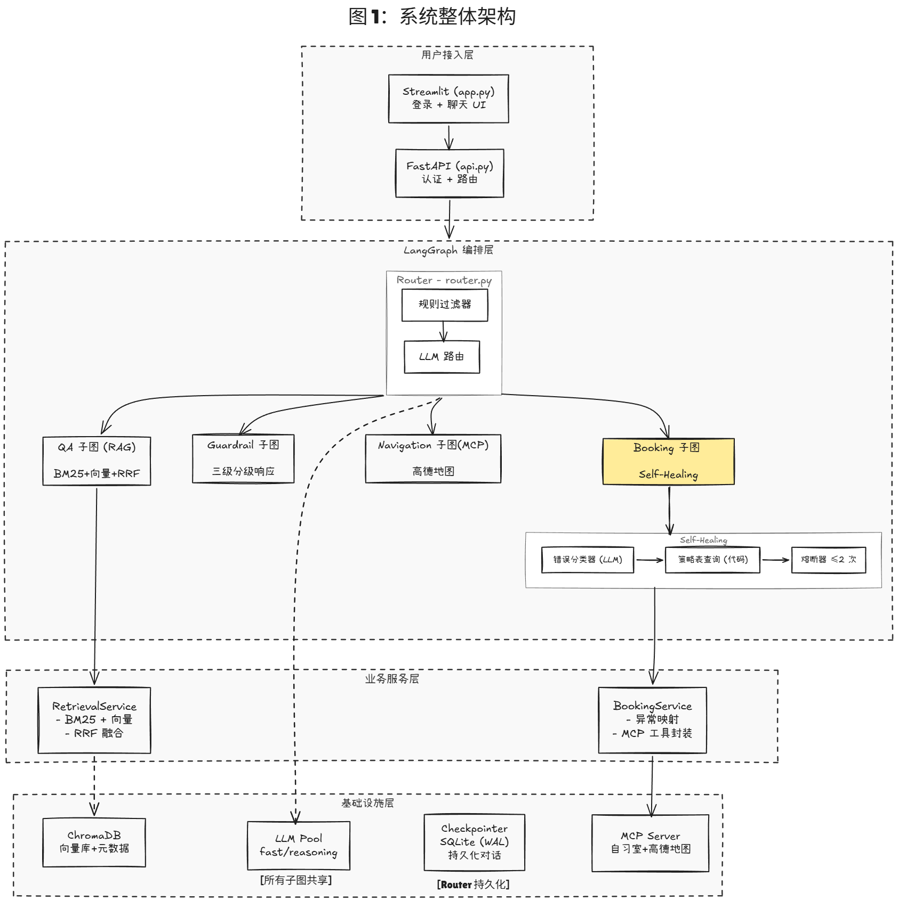

# 梦想自习室 LangGraph Self-Healing Agent

[](https://github.com/Jmiao11/langgraph-self-healing-agent/actions/workflows/ci.yml)

> 具备异常自愈与多层安全机制的智能自习室预约系统。

## 🌟 核心能力

- **代码层异常自愈路由**：工具失败时通过元数据短路查表，已知异常 0 LLM 调用直接匹配修复策略，未知异常降级 LLM 兜底分类（V4 架构实测 6 大核心异常 Case 100% 自动恢复）。
- **物理级多层身份隔离**：HMAC-SHA256 Token 认证 + 工具签名参数物理删除 + 服务层强制身份覆盖，彻底斩断 Prompt 注入与身份伪造（实测拦截 3 类核心越权攻击场景）。
- **防越权（IDOR）原子级 CRUD**：业务底层严格执行"存在 → 归属 → 状态"三段式校验，跨表操作保障数据强一致性，配合静默响应杜绝资产信息泄露。
- **多子图编排 + 消息视图隔离**：四类子图（QA/Booking/Navigation/Guardrail）按意图路由，子图 LLM 只读取自身工具调用历史，跨子图上下文 0 污染（实测 prompt_tokens 降低 66%）。

------

## 🏗️ 系统架构

> 详见 `docs/architecture.excalidraw` 或下方架构图。



**四层架构**：

| 层         | 职责                             | 关键文件                         |
| ---------- | -------------------------------- | -------------------------------- |
| 用户接入层 | HTTP 认证 + Streamlit UI         | `api.py`, `app.py`               |
| 编排层     | 多子图路由 + 状态总线            | `graphs/`                        |
| 业务服务层 | 异常映射 + RRF 检索融合          | `services/`                      |
| 基础设施层 | LLM 池 + ChromaDB + SQLite + MCP | `infrastructure/`, `mcp_server/` |

------

## ⚙️ 核心设计亮点

### Self-Healing：V1 → V4 演进

| 版本 | 核心改动                          | 解决的问题                                      |
| ---- | --------------------------------- | ----------------------------------------------- |
| V1   | LLM 全权决策（RepairDecision）    | 基线——LLM 自相矛盾 + 幻觉工具名                 |
| V2   | Classify-then-Decide + 策略表查表 | 剥离 LLM 决策权，代码层确定性路由               |
| V3   | Prompt 边界锚定（四层防御）       | 解决 LLM 语义边界混淆（SEAT_OCCUPIED 被误分类） |
| V4   | 异常元数据短路路由                | 已知异常 0 LLM 调用，移除错误的设计前提         |

> 完整演进细节见 [`docs/DESIGN.md` §3.2](docs/DESIGN.md)

### 多层身份隔离

```
请求 → HMAC Token 验签 → trusted_sid 强制覆盖 body
       ↓
  make_tools_for_user(authenticated_sid)
  # student_id 从工具签名物理删除，LLM 无法传递
       ↓
  cancel_booking(booking_id)  ← LLM 只看到这个
  # 底层: cancel_booking(authenticated_sid, booking_id)
       ↓
  DB 层: 存在 → 归属 → 状态  三段式校验
```

### 双路 RRF 融合检索

BM25 字面量召回 + 向量语义召回，RRF 算法融合排序，支持 LLM 自动元数据打标过滤。

------

## 🚀 快速开始

```bash
# 1. 配置环境变量
cp .env.example .env
# 填入 MOONSHOT_API_KEY / SILICONFLOW_API_KEY / AUTH_SECRET_KEY / AMAP_MAPS_API_KEY

# 2. 安装依赖
pip install -r requirements.txt

# 3. 初始化数据库与向量库
python mcp_server/init_db.py
python graphs/init_vector_db.py

# 4. 启动后端 API
python api.py

# 5. 启动前端（新开终端）
streamlit run app.py
```

**测试账号**：学号 `stu001` / 密码 `123`

------

## 🛠️ 技术栈

| 类别       | 技术                                       |
| ---------- | ------------------------------------------ |
| Agent 框架 | LangGraph, LangChain                       |
| LLM        | Moonshot Kimi（moonshot-v1-32k / 8k）      |
| 向量检索   | ChromaDB + BAAI/bge-m3（SiliconFlow）      |
| 关键词检索 | BM25（rank-bm25）                          |
| 工具协议   | MCP（Model Context Protocol）              |
| 持久化     | SQLite + WAL 模式，AsyncSqliteSaver        |
| Web 层     | FastAPI（api层） + Streamlit（前端）       |
| 安全       | HMAC-SHA256（Python 标准库，0 第三方依赖） |

------

## ⚠️ 已知限制与边界

| 限制项               | 现状                                                         | 说明                                                         |
| -------------------- | ------------------------------------------------------------ | ------------------------------------------------------------ |
| **数据库并发**       | SQLite + WAL，单机轻并发                                     | 生产场景需替换 PostgreSQL + 行锁                             |
| **多 Provider 兜底** | LLM 池仅接入 Moonshot                                        | 工厂函数已预留扩展点，未实测 GPT/Claude 切换                 |
| **测试覆盖**         | 自愈核心逻辑已覆盖（L1 纯函数 + L2 mock，31 用例），路由/子图集成层仍黑盒 | error_analyzer 已用 mock 调用计数验证 V4 短路 0 LLM 调用；集成层（含 MCP）待补 |
| **模型名配置**       | 硬编码在 `dependencies.py`                                   | 生产化应抽到 `.env`（已记技术债）                            |

> 详见 [`docs/DESIGN.md §1.4`](https://claude.ai/chat/docs/DESIGN.md)。

------

## 📄 License

MIT